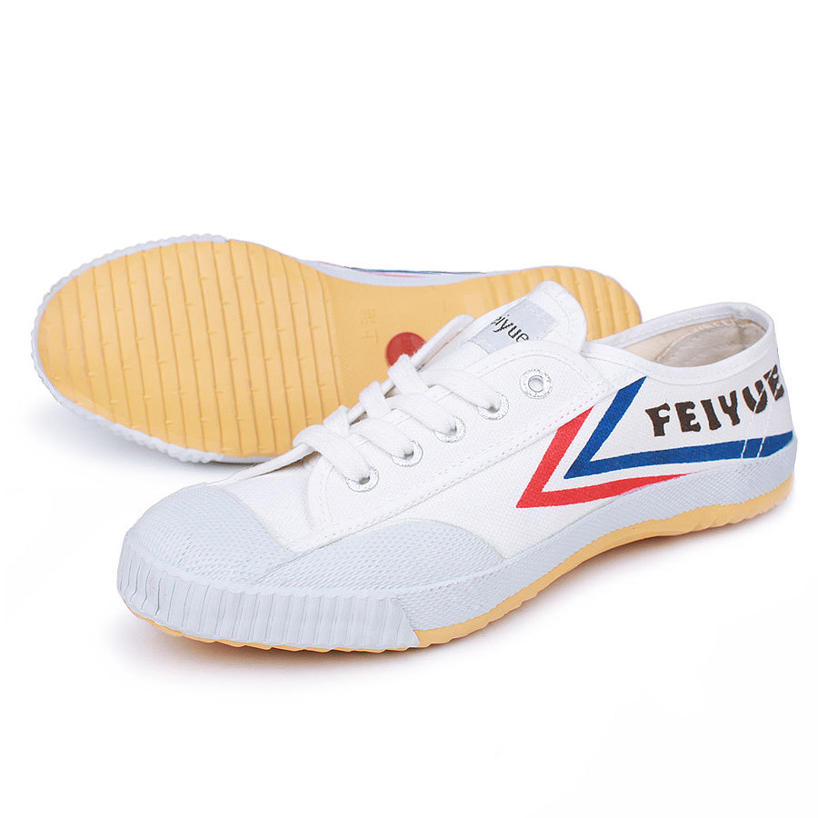

## Форма одежды

Обувь для занятий ушу должна иметь тонкую не скользкую подошву, быть легкой и эластичной. Тонкая подошва необходима для того, чтобы спортсмен чувствовал себя устойчиво, мог выполнить разнообразные движения.

Не допускается наличие на обуви шипов, металлических включений (застёжек, пряжек), которые могут быть причиной всякого рода повреждений. Кеды не должны быть тесными, так как это нарушает нормальное кровообращение и теплоотдачу, но и ношение слишком просторной обуви имеет свои недостатки и нередко ведет к образованию потертостей и мозолей. Желательно покупать кеды не на липучках, а на шнурках, так как они лучше фиксируют стопу.

Спортивная форма должна учитывать характер движений на тренировках, быть по возможности легкой и не стеснять движений. Для занятий ушу подходит обычная футболка и спортивные штаны. В зимнее время на тренировках для сохранения тепла пригодится толстовка.

Предпочтение следует отдавать спортивной одежде изготовленной из эластичной ткани с высокой воздухопроницаемостью, хорошо впитывающей пот и способствующей его быстрому испарению.

Одежда не должна иметь твердых застежек или молний. В карманах на тренировке запрещается держать твердые и острые предметы (ключи, телефоны, заколки и т.д.).

